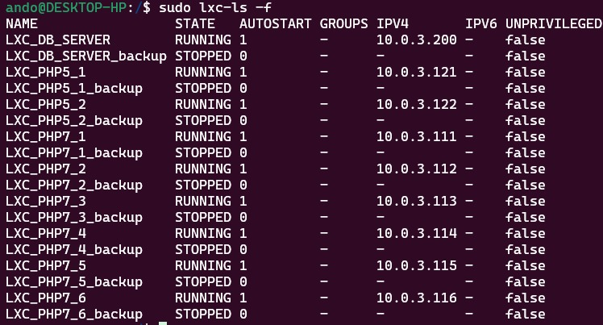
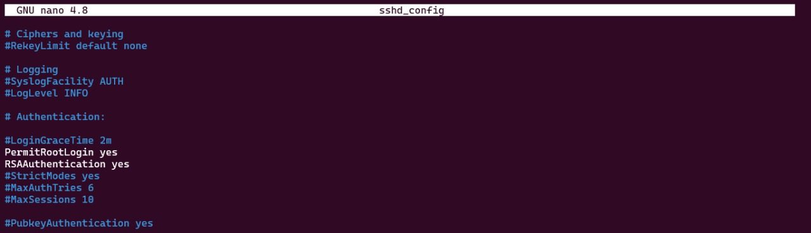
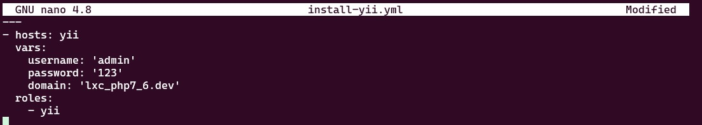
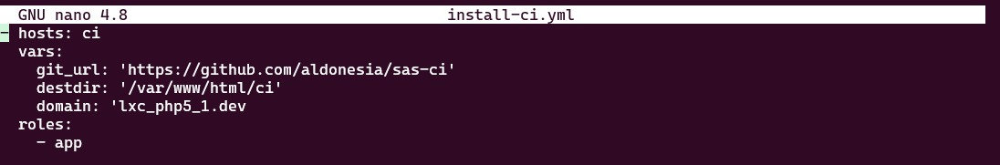

# Tugas Besar Sistem Terdistribusi
# Kelompok 12:
- 1203210013 - Enrico Sulfriando Sinaga
- 1203210145 - Aditya Aulia Rohman

1. Buat 10 Linux container, 6 container menggunakan template ubuntu 20.04 dan 3 menggunakan template debian 10
```sh
# LXC UBUNTU 20.04
sudo lxc-create -n LXC_PHP7_1 -t download -- --dist ubuntu --release focal --arch amd64 --force-cache --server images.linuxcontainers.org
sudo lxc-create -n LXC_PHP7_2 -t download -- --dist ubuntu --release focal --arch amd64 --force-cache --server images.linuxcontainers.org
sudo lxc-create -n LXC_PHP7_3 -t download -- --dist ubuntu --release focal --arch amd64 --force-cache --server images.linuxcontainers.org
sudo lxc-create -n LXC_PHP7_4 -t download -- --dist ubuntu --release focal --arch amd64 --force-cache --server images.linuxcontainers.org
sudo lxc-create -n LXC_PHP7_5 -t download -- --dist ubuntu --release focal --arch amd64 --force-cache --server images.linuxcontainers.org
sudo lxc-create -n LXC_PHP7_6 -t download -- --dist ubuntu --release focal --arch amd64 --force-cache --server images.linuxcontainers.org

# LXC DEBIAN 10 
sudo lxc-create -n LXC_PHP5_1 -t download -- --dist debian --release buster --arch amd64 --force-cache --server images.linuxcontainers.org
sudo lxc-create -n LXC_PHP5_2 -t download -- --dist debian --release buster --arch amd64 --force-cache --server images.linuxcontainers.org
sudo lxc-create -n LXC_DB_SERVER -t download -- --dist debian --release buster --arch amd64 --force-cache --server images.linuxcontainers.org
```

2. Setting IP setiap LXC dan set LXC menjadi auto start

3. Install dan setting SSH buat menjadi itu Permitlogin yes
rssaauthentication yes
```
cd /etc/ssh
sudo nano sshd_config
```

4. Restart ssh service
```
sudo service sshd restart
```
5. lalu setting password
```
passwd
```
6. Install Ansible
```
sudo apt install ansible sshpass
```
7. Buat folder baru untuk mengerjakan configure ansible 
```
cd ~/ansible
sudo mkdir -p TUBES
cd TUBES
```
8. Buat file hosts yang berisi:
```
[Laravel]
lxc_php7_1 ansible_host=lxc_php7_2.dev ansible_ssh_user=root ansible_become_pass=123
lxc_php7_2 ansible_host=lxc_php7_3.dev ansible_ssh_user=root ansible_become_pass=123
lxc_php7_3 ansible_host=lxc_php7_4.dev ansible_ssh_user=root ansible_become_pass=123
lxc_php7_4 ansible_host=lxc_php7_5.dev ansible_ssh_user=root ansible_become_pass=123

[Wordpress]
lxc_php_1 ansible_host=lxc_php7_1.dev ansible_ssh_user=root ansible_become_pass=123
lxc_php_2 ansible_host=lxc_php7_2.dev ansible_ssh_user=root ansible_become_pass=123
lxc_php_3 ansible_host=lxc_php7_4.dev ansible_ssh_user=root ansible_become_pass=123
lxc_php_4 ansible_host=lxc_php7_6.dev ansible_ssh_user=root ansible_become_pass=123

[database]
lxc_mariadb  ansible_host=lxc_mariadb.dev ansible_ssh_user=root ansible_become_pass=123

[yii]
yii_1 ansible_host=lxc_php7_1.dev ansible_ssh_user=root ansible_become_pass=123
yii_2 ansible_host=lxc_php7_2.dev ansible_ssh_user=root ansible_become_pass=123
yii_3 ansible_host=lxc_php7_4.dev ansible_ssh_user=root ansible_become_pass=123
yii_4 ansible_host=lxc_php7_5.dev ansible_ssh_user=root ansible_become_pass=123
yii_5 ansible_host=lxc_php7_6.dev ansible_ssh_user=root ansible_become_pass=123

[ci]
ci_1 ansible_host=lxc_php5_1.dev ansible_ssh_user=root ansible_become_pass=123
ci_2 ansible_host=lxc_php5_2.dev ansible_ssh_user=root ansible_become_pass=123
```
9. Membuat install-mariadb.yml, yang berisi
```
- hosts: database
  vars:
    username: 'admin'
    password: '123'
    domain: 'lxc_mariadb.dev'
  roles:
    - db
    - pma
```
10. membuat install-Laravel.yml yg berisi 
```
---
- hosts: Laravel
  vars:
    username: 'admin'
    password: '123'
    domain: 'lxc_php7_2.dev'
  roles:
    - php
    - lv
```

11. Membuat install-yii.yml yang berisi
```
---
- hosts: yii
  vars:
    username: 'admin'
    password: '123'
    domain: 'lxc_php7_6.dev'
  roles:
    - yii
```

12. Membuat install-ci.yml yang berisi
```
- hosts: ci
  vars:
    git_url: 'https://github.com/aldonesia/sas-ci'
    destdir: '/var/www/html/ci'
    domain: 'lxc_php5_1.dev
  roles:
    - app
```

13. Membuat install-wp.yml
```
---
- hosts: Wordpress
  vars:
    username: 'admin'
    password: '123'
    domain: 'lxc_php7_1.dev'
  roles:
    - wp
```
14. lalu buat folder roles/lv/tasks
```
sudo mkdir -p roles/lv/tasks
```
15. lalu buat file main.yml yang berisi
```
---
- name: delete apt cache
  become: yes
  become_user: root
  become_method: su
  command: rm -vf /var/lib/apt/lists/*

- name: Download and install Composer
  shell: curl -sS https://getcomposer.org/installer | php
  args:
    chdir: /usr/src/
    creates: /usr/local/bin/composer
    warn: false
  become: yes

- name: Add Composer to global path
  copy:
    dest: /usr/local/bin/composer
    group: root
    mode: '0755'
    owner: root
    src: /usr/src/composer.phar
    remote_src: yes
  become: yes
- name: Ansible delete file create-project
  file:
    path: /var/www/html/landing
    state: absent

- name: composer create-project
  shell: /usr/local/bin/composer create-project laravel/laravel /var/www/html/landing --prefer-dist --no-in>

- name: key
  shell: /usr/bin/php7.4 /var/www/html/landing/artisan key:generate

- name: chmod
  become: yes
  become_user: root
  become_method: su
  command: chmod 777 -R /var/www/html/landing/storage

- name: Copy env.template
  template:
    src=templates/env.template
    dest=/var/www/html/landing/.env

- name: Copy lv.conf
  template:
    src=templates/lv.conf
    dest=/etc/nginx/sites-available/{{ domain }}
  vars:
    servername: '{{ domain }}'

- name: copy php7.conf
  template:
    src=templates/php7.conf
    dest=/etc/php/7.4/fpm/pool.d/www.conf

- name: Symlink lv.conf
  command: ln -sfn /etc/nginx/sites-available/{{ domain }} /etc/nginx/sites-enabled/{{ domain }}
  notify:
    - restart nginx

- name: Write {{ domain }} to /etc/hosts
  lineinfile:
    dest: /etc/hosts
    regexp: '.*{{ domain }}$'
    line: "127.0.0.1 {{ domain }}"
    state: present
```
16. 
```
cd ../
sudo mkdir -p templates
cd templates
sudo nano env.template
```
```
APP_NAME=Laravel
APP_ENV=local
APP_KEY=
APP_DEBUG=true
APP_URL=http://vm.local

LOG_CHANNEL=stack
LOG_DEPRECATIONS_CHANNEL=null
LOG_LEVEL=debug

DB_CONNECTION=mysql
DB_HOST=10.0.3.200
DB_PORT=3306
DB_DATABASE=landing
DB_USERNAME=admin
DB_PASSWORD=123

BROADCAST_DRIVER=log
CACHE_DRIVER=file
FILESYSTEM_DRIVER=local
QUEE_CONNECTION=sync
SESSION_DRIVER=file
SESSION_LIFETIME=120

MEMCACHED_HOST=127.0.0.1
REDIS_HOST=127.0.0.1
REDIS_PASSWORD=null
REDIS_PORT=6379

MAIL_MAILER=smtp
MAIL_HOSTS=mailhog
MAIL_PORT=1025
MAIL_USERNAME=null
MAIL_PASSWORD=null
MAIL_ENCRYPTION=null
MAIL_FROM_ADDRESS=null
MAIL_FROM_NAME="${APP_NAME}"

AWS_ACCESS_KEY_ID=
AWS_SECRET_ACCES_KEY=
AWS_DEFAULT_REGION=us-east-1
AWS_BUCKET=
AWS_USE_PATH_STYLE_ENDPOINT=false

PUSHER_APP_ID=
PUSHER_APP_KEY=
PUSHER_APP_SECRET=
PUSHER_APP_CLUSTER=mt1

MIX_PUSHER_APP_KEY="${PUSHER_APP_KEY}"
MIX_PUSHER_APP_CLUSTER="${PUSHER_APP_CLUSTER}"
```
17. 
```
sudo nano lv.conf 
```
```
server {
     listen 80;
     listen [::]:80;
     # Log files for Debugging
     access_log /var/log/nginx/vhostlaravel-acces.log;
     error_log /var/log/nginx/vhostlaravel-error.log;
     # Webroot Directory for Laravel Project
     root /var/www/html/landing/public;
     index index.php index.html index.htm;

     # Your Domain Name
     server_name {{servername}};

     location / {
             try_files $uri $uri/ /index/.php?$query_string;
     }
     # PHP-FPM Configuration Nginx
     location ~ \.php$ {
             try_files $uri =404;
             fastcgi_split_path_info ^(.+\.php)(/.+)$;
             fastcgi_pass 127.0.0.1:9001;
             fastcgi_index index.php;
             fastcgi_param SCRIPT_FILENAME $document_root$fastcgi_script_name;
             include fastcgi_params;
     }
}
```
18. 
```
sudo nano php7.conf
```
```
; Start a new pool named 'www'.
; the variable $pool can we used in any directive and will be replaced by the
; pool name ('www' here)
[www]

; Per pool prefix
; It only applies on the following directives:
; - 'slowlog'
; - 'listen' (unixsocket)
; - 'chroot'
; - 'chdir'
; - 'php_values'
; - 'php_admin_values'
; When not set, the global prefix (or /usr) applies instead.
; Note: This directive can also be relative to the global prefix.
; Default Value: none
;prefix = /path/to/pools/$pool

; Unix user/group of processes
; Note: The user is mandatory. If the group is not set, the default user's group
;       will be used.
user = www-data
group = www-data

; The address on which to accept FastCGI requests.
; Valid syntaxes are:
;   'ip.add.re.ss:port'    - to listen on a TCP socket to a specific address on
;                            a specific port;
;   'port'                 - to listen on a TCP socket to all addresses on a
;                            specific port;
;   '/path/to/unix/socket' - to listen on a unix socket.
; Note: This value is mandatory.
listen = 127.0.0.1:9001

; Set listen(2) backlog. A value of '-1' means unlimited.
; Default Value: 128 (-1 on FreeBSD and OpenBSD)
;listen.backlog = -1

; Set permissions for unix socket, if one is used. In Linux, read/write
; permissions must be set in order to allow connections from a web server. Many
; BSD-derived systems allow connections regardless of permissions.
; Default Values: user and group are set as the running user
;                 mode is set to 0666
listen.owner = www-data
listen.group = www-data
listen.mode = 0666

; List of ipv4 addresses of FastCGI clients which are allowed to connect.
; Equivalent to the FCGI_WEB_SERVER_ADDRS environment variable in the original
; PHP FCGI (5.2.2+). Makes sense only with a tcp listening socket. Each address
; must be separated by a comma. If this value is left blank, connections will be
; accepted from any ip address.
; Default Value: any
;listen.allowed_clients = 127.0.0.1

; Choose how the process manager will control the number of child processes.
; Possible Values:
;   static  - a fixed number (pm.max_children) of child processes;
;   dynamic - the number of child processes are set dynamically based on the
;             following directives. With this process management, there will be
;             always at least 1 children.
;             pm.max_children      - the maximum number of children that can
;                                    be alive at the same time.
;             pm.start_servers     - the number of children created on startup.
;             pm.min_spare_servers - the minimum number of children in 'idle'
;                                    state (waiting to process). If the number
;                                    of 'idle' processes is less than this
;                                    number then some children will be created.
;             pm.max_spare_servers - the maximum number of children in 'idle'
;                                    state (waiting to process). If the number
;                                    of 'idle' processes is greater than this
;                                    number then some children will be killed.
;  ondemand - no children are created at startup. Children will be forked when
;             new requests will connect. The following parameter are used:
;             pm.max_children           - the maximum number of children that
;                                         can be alive at the same time.
;             pm.process_idle_timeout   - The number of seconds after which
;                                         an idle process will be killed.
; Note: This value is mandatory.
pm = dynamic

; The number of child processes to be created when pm is set to 'static' and the
; maximum number of child processes when pm is set to 'dynamic' or 'ondemand'.
; This value sets the limit on the number of simultaneous requests that will be
; served. Equivalent to the ApacheMaxClients directive with mpm_prefork.
; Equivalent to the PHP_FCGI_CHILDREN environment variable in the original PHP
; CGI. The below defaults are based on a server without much resources. Don't
; forget to tweak pm.* to fit your needs.
; Note: Used when pm is set to 'static', 'dynamic' or 'ondemand'
; Note: This value is mandatory.
pm.max_children = 5

; The number of child processes created on startup.
; Note: Used only when pm is set to 'dynamic'
; Default Value: min_spare_servers + (max_spare_servers - min_spare_servers) / 2
pm.start_servers = 2

; The desired minimum number of idle server processes.
; Note: Used only when pm is set to 'dynamic'
; Note: Mandatory when pm is set to 'dynamic'
pm.min_spare_servers = 1

; The desired maximum number of idle server processes.
; Note: Used only when pm is set to 'dynamic'
; Note: Mandatory when pm is set to 'dynamic'
pm.max_spare_servers = 3

; The number of seconds after which an idle process will be killed.
; Note: Used only when pm is set to 'ondemand'
; Default Value: 10s
;pm.process_idle_timeout = 10s;

; The number of requests each child process should execute before respawning.
; This can be useful to work around memory leaks in 3rd party libraries. For
; endless request processing specify '0'. Equivalent to PHP_FCGI_MAX_REQUESTS.
; Default Value: 0
pm.max_requests = 100

; The URI to view the FPM status page. If this value is not set, no URI will be
; recognized as a status page. It shows the following informations:
;   pool                 - the name of the pool;
;   process manager      - static, dynamic or ondemand;
;   start time           - the date and time FPM has started;
;   start since          - number of seconds since FPM has started;
;   accepted conn        - the number of request accepted by the pool;
;   listen queue         - the number of request in the queue of pending
;                          connections (see backlog in listen(2));
;   max listen queue     - the maximum number of requests in the queue
;                          of pending connections since FPM has started;
;   listen queue len     - the size of the socket queue of pending connections;
;   idle processes       - the number of idle processes;
;   active processes     - the number of active processes;
;   total processes      - the number of idle + active processes;
;   max active processes - the maximum number of active processes since FPM
;                          has started;
;   max children reached - number of times, the process limit has been reached,
;                          when pm tries to start more children (works only for
;                          pm 'dynamic' and 'ondemand');
; Value are updated in real time.
; Example output:
;   pool:                 www
;   process manager:      static
;   start time:           01/Jul/2011:17:53:49 +0200
;   start since:          62636
;   accepted conn:        190460
;   listen queue:         0
;   max listen queue:     1
;   listen queue len:     42
;   idle processes:       4
;   active processes:     11
;   total processes:      15
;   max active processes: 12
;   max children reached: 0
;
; By default the status page output is formatted as text/plain. Passing either
; 'html', 'xml' or 'json' in the query string will return the corresponding
; output syntax. Example:
;   http://www.foo.bar/status
;   http://www.foo.bar/status?json
;   http://www.foo.bar/status?html
;   http://www.foo.bar/status?xml
;
; By default the status page only outputs short status. Passing 'full' in the
; query string will also return status for each pool process.
; Example:
;   http://www.foo.bar/status?full
;   http://www.foo.bar/status?json&full
;   http://www.foo.bar/status?html&full
;   http://www.foo.bar/status?xml&full
; The Full status returns for each process:
;   pid                  - the PID of the process;
;   state                - the state of the process (Idle, Running, ...);
;   start time           - the date and time the process has started;
;   start since          - the number of seconds since the process has started;
;   requests             - the number of requests the process has served;
;   request duration     - the duration in µs of the requests;
;   request method       - the request method (GET, POST, ...);
;   request URI          - the request URI with the query string;
;   content length       - the content length of the request (only with POST);
;   user                 - the user (PHP_AUTH_USER) (or '-' if not set);
;   script               - the main script called (or '-' if not set);
;   last request cpu     - the %cpu the last request consumed
;                          it's always 0 if the process is not in Idle state
;                          because CPU calculation is done when the request
;                          processing has terminated;
;   last request memory  - the max amount of memory the last request consumed
;                          it's always 0 if the process is not in Idle state
;                          because memory calculation is done when the request
;                          processing has terminated;
; If the process is in Idle state, then informations are related to the
; last request the process has served. Otherwise informations are related to
; the current request being served.
; Example output:
;   ********
;   pid:                  31330
;   state:                Running
;   start time:           01/Jul/2011:17:53:49 +0200
;   start since:          63087
;   requests:             12808
;   request duration:     1250261
;   request method:       GET
;   request URI:          /test_mem.php?N=10000
;   content length:       0
;   user:                 -
;   script:               /home/fat/web/docs/php/test_mem.php
;   last request cpu:     0.00
;   last request memory:  0
;
; Note: There is a real-time FPM status monitoring sample web page available
;       It's available in: ${prefix}/share/fpm/status.html
;
; Note: The value must start with a leading slash (/). The value can be
;       anything, but it may not be a good idea to use the .php extension or it
;       may conflict with a real PHP file.
; Default Value: not set
pm.status_path = /php-status

; The ping URI to call the monitoring page of FPM. If this value is not set, no
; URI will be recognized as a ping page. This could be used to test from outside
; that FPM is alive and responding, or to
; - create a graph of FPM availability (rrd or such);
; - remove a server from a group if it is not responding (load balancing);
; - trigger alerts for the operating team (24/7).
; Note: The value must start with a leading slash (/). The value can be
;       anything, but it may not be a good idea to use the .php extension or it
;       may conflict with a real PHP file.
; Default Value: not set
;ping.path = /ping

; This directive may be used to customize the response of a ping request. The
; response is formatted as text/plain with a 200 response code.
; Default Value: pong
;ping.response = pong

; The access log file
; Default: not set
;access.log = log/$pool.access.log

; The access log format.
; The following syntax is allowed
;  %%: the '%' character
;  %C: %CPU used by the request
;      it can accept the following format:
;      - %{user}C for user CPU only
;      - %{system}C for system CPU only
;      - %{total}C  for user + system CPU (default)
;  %d: time taken to serve the request
;      it can accept the following format:
;      - %{seconds}d (default)
;      - %{miliseconds}d
;      - %{mili}d
;      - %{microseconds}d
;      - %{micro}d
;  %e: an environment variable (same as $_ENV or $_SERVER)
;      it must be associated with embraces to specify the name of the env
;      variable. Some exemples:
;      - server specifics like: %{REQUEST_METHOD}e or %{SERVER_PROTOCOL}e
;      - HTTP headers like: %{HTTP_HOST}e or %{HTTP_USER_AGENT}e
;  %f: script filename
;  %l: content-length of the request (for POST request only)
;  %m: request method
;  %M: peak of memory allocated by PHP
;      it can accept the following format:
;      - %{bytes}M (default)
;      - %{kilobytes}M
;      - %{kilo}M
;      - %{megabytes}M
;      - %{mega}M
;  %n: pool name
;  %o: ouput header
;      it must be associated with embraces to specify the name of the header:
;      - %{Content-Type}o
;      - %{X-Powered-By}o
;      - %{Transfert-Encoding}o
;      - ....
;  %p: PID of the child that serviced the request
;  %P: PID of the parent of the child that serviced the request
;  %q: the query string
;  %Q: the '?' character if query string exists
;  %r: the request URI (without the query string, see %q and %Q)
;  %R: remote IP address
;  %s: status (response code)
;  %t: server time the request was received
;      it can accept a strftime(3) format:
;      %d/%b/%Y:%H:%M:%S %z (default)
;  %T: time the log has been written (the request has finished)
;      it can accept a strftime(3) format:
;      %d/%b/%Y:%H:%M:%S %z (default)
;  %u: remote user
;
; Default: "%R - %u %t \"%m %r\" %s"
;access.format = %R - %u %t "%m %r%Q%q" %s %f %{mili}d %{kilo}M %C%%

; The log file for slow requests
; Default Value: not set
; Note: slowlog is mandatory if request_slowlog_timeout is set
;slowlog = log/$pool.log.slow

; The timeout for serving a single request after which a PHP backtrace will be
; dumped to the 'slowlog' file. A value of '0s' means 'off'.
; Available units: s(econds)(default), m(inutes), h(ours), or d(ays)
; Default Value: 0
;request_slowlog_timeout = 0

; The timeout for serving a single request after which the worker process will
; be killed. This option should be used when the 'max_execution_time' ini option
; does not stop script execution for some reason. A value of '0' means 'off'.
; Available units: s(econds)(default), m(inutes), h(ours), or d(ays)
; Default Value: 0
;request_terminate_timeout = 0

; Set open file descriptor rlimit.
; Default Value: system defined value
;rlimit_files = 1024

; Set max core size rlimit.
; Possible Values: 'unlimited' or an integer greater or equal to 0
; Default Value: system defined value
;rlimit_core = 0

; Chroot to this directory at the start. This value must be defined as an
; absolute path. When this value is not set, chroot is not used.
; Note: you can prefix with '$prefix' to chroot to the pool prefix or one
; of its subdirectories. If the pool prefix is not set, the global prefix
; will be used instead.
; Note: chrooting is a great security feature and should be used whenever
;       possible. However, all PHP paths will be relative to the chroot
;       (error_log, sessions.save_path, ...).
; Default Value: not set
;chroot =

; Chdir to this directory at the start.
; Note: relative path can be used.
; Default Value: current directory or / when chroot
chdir = /

; Redirect worker stdout and stderr into main error log. If not set, stdout and
; stderr will be redirected to /dev/null according to FastCGI specs.
; Note: on highloaded environement, this can cause some delay in the page
; process time (several ms).
; Default Value: no
catch_workers_output = yes

; Limits the extensions of the main script FPM will allow to parse. This can
; prevent configuration mistakes on the web server side. You should only limit
; FPM to .php extensions to prevent malicious users to use other extensions to
; exectute php code.
; Note: set an empty value to allow all extensions.
; Default Value: .php
;security.limit_extensions = .php .php3 .php4 .php5 .php7

; Pass environment variables like LD_LIBRARY_PATH. All $VARIABLEs are taken from
; the current environment.
; Default Value: clean env
;env[HOSTNAME] = $HOSTNAME
env[PATH] = /srv/www/phpcs/scripts/:/usr/local/bin:/usr/bin:/bin
;env[TMP] = /tmp
;env[TMPDIR] = /tmp
;env[TEMP] = /tmp

; Additional php.ini defines, specific to this pool of workers. These settings
; overwrite the values previously defined in the php.ini. The directives are the
; same as the PHP SAPI:
;   php_value/php_flag             - you can set classic ini defines which can
;                                    be overwritten from PHP call 'ini_set'.
;   php_admin_value/php_admin_flag - these directives won't be overwritten by
;                                     PHP call 'ini_set'
; For php_*flag, valid values are on, off, 1, 0, true, false, yes or no.

; Defining 'extension' will load the corresponding shared extension from
; extension_dir. Defining 'disable_functions' or 'disable_classes' will not
; overwrite previously defined php.ini values, but will append the new value
; instead.

; Note: path INI options can be relative and will be expanded with the prefix
; (pool, global or /usr)

; Default Value: nothing is defined by default except the values in php.ini and
;                specified at startup with the -d argument
;php_admin_value[sendmail_path] = /usr/sbin/sendmail -t -i -f www@my.domain.com
;php_flag[display_errors] = off
;php_admin_value[error_log] = /var/log/fpm-php.www.log
;php_admin_flag[log_errors] = on
;php_admin_value[memory_limit] = 32M
```
19. 
```
cd ../
sudo mkdir -p handlers
sudo nano main.yml
```
```
---
- name: restart php
  become: yes
  become_user: root
  become_method: su
  action: service name=php7.4-fpm state=restarted

- name: restart nginx
  become: yes
  become_user: root
  become_method: su
  action: service name=nginx state=restarted
```
20. selanjutnya membuat db
```
cd ../../
sudo mkdir -p db/tasks
sudo mkdir -p db/templates
sudo mkdir -p db/handlers
```
21. 
```
cd db/tasks
sudo nano main.yml
```
```
---
- name: delete apt chache
  become: yes
  become_user: root
  become_method: su
  command: rm -vf /var/lib/apt/lists/*

- name: install mariadb
  become: yes
  become_user: root
  become_method: su
  apt: name={{ item }} state=latest update_cache=true
  with_items:
   - python
   - mariadb-server
   - python-mysqldb
   - python-pymysql

- name: Stop MySQL
  service: name=mysqld state=stopped

- name: set environment variables
  shell: systemctl set-environment MYSQLD_OPTS="--skip-grant-tables"

- name: Start MySQL
  service: name=mysqld state=started

- name: sql query
  command:  mysql -u root --execute="UPDATE mysql.user SET authentication_string = PASSWORD('{{ password }}') WHERE User = 'root' AN>

- name: sql query flush
  command:  mysql -u root --execute="FLUSH PRIVILEGES"

- name: Stop MySQL
  service: name=mysqld state=stopped

- name: unset environment variables
  shell: systemctl unset-environment MYSQLD_OPTS

- name: Start MySQL
  service: name=mysqld state=started

- name: Create user for mysql
  command:  mysql -u root --execute="CREATE USER IF NOT EXISTS '{{ username }}'@'localhost' IDENTIFIED BY '{{ password }}';"

- name: GRANT ALL PRIVILEGES to user {{username}}
  command:  mysql -u root --execute="GRANT ALL PRIVILEGES ON * . * TO '{{ username }}'@'localhost';"

- name: Create user for remote mysql
  command:  mysql -u root --execute="CREATE USER IF NOT EXISTS '{{ username }}'@'%' IDENTIFIED BY '{{ password }}';"

- name: GRANT ALL PRIVILEGES to remote user {{username}}
  command:  mysql -u root --execute="GRANT ALL PRIVILEGES ON * . * TO '{{ username }}'@'%';"

- name: sql query flush
  command:  mysql -u root --execute="FLUSH PRIVILEGES"

- name: Create DB Landing
  command:  mysql -u root --execute="CREATE DATABASE IF NOT EXISTS landing;"

- name: Create DB blog
  command:  mysql -u root --execute="CREATE DATABASE IF NOT EXISTS blog;"

- name: Create DB app
  command:  mysql -u root --execute="CREATE DATABASE IF NOT EXISTS app;"

- name: Create DB product
  command:  mysql -u root --execute="CREATE DATABASE IF NOT EXISTS product;"

- name: Copy .my.cnf file with root password credentials
  template:
    src=templates/my.cnf
    dest=/etc/mysql/mariadb.conf.d/50-server.cnf
  notify: restart mysql
```
22. 
```
cd ../
cd handlers
sudo nano main.yml
```
```
---
- name: restart mysql
  become: yes
  become_user: root
  become_method: su
  action: service name=mysql state=restarted
```
23. Buat folder task, templates, dan handlers
```
cd ../../
sudo mkdir -p pma/tasks
sudo mkdir -p pma/templates
sudo mkdir -p pma/handlers
```
24. 
```
cd pma/tasks
sudo nano main.yml
```
```
---
- name: delete apt chache
  become: yes
  become_user: root
  become_method: su
  command: rm -vf /var/lib/apt/lists/*

- name: install requirement dpkg to install php5
  become: yes
  become_user: root
  become_method: su
  apt: name={{ item }} state=latest update_cache=true
  with_items:
    - ca-certificates
    - apt-transport-https
    - wget
    - curl
    - python-apt
    - software-properties-common
    - git

- name: Add key
  apt_key:
    url: https://packages.sury.org/php/apt.gpg
    state: present

- name: Add Php Repository
  apt_repository:
      repo: "deb https://packages.sury.org/php/ stretch main"
      state: present
      filename: php.list
      update_cache: true

- name: wget repository php
  shell: wget -O /etc/apt/trusted.gpg.d/php.gpg https://packages.sury.org/php/apt.gpg

- name: add repository php
  shell: echo "deb https://packages.sury.org/php/ $(lsb_release -sc) main" | tee /etc/apt/sources.list.d/php.list

- name: wget repository
  shell: wget https://files.phpmyadmin.net/phpMyAdmin/5.1.1/phpMyAdmin-5.1.1-all-languages.tar.gz

- name: tar phpmyadmin
  shell: tar -zxvf phpMyAdmin-5.1.1-all-languages.tar.gz

- name: move phpmyadmin
  shell: mv phpMyAdmin-5.1.1-all-languages /usr/share/phpMyAdmin

- name: apt update
  shell: apt update

- name: install nginx phpmyadmin
  become: yes
  become_user: root
  become_method: su
  apt: name={{ item }} state=latest update_cache=true
  with_items:
    - curl
    - nginx
    - nginx-extras
    - php7.2-fpm
    - php7.2-mysqli
    - php7.2-xml
    - php-mbstring
    - php-zip
    - php-gd
    - php-json
    - php-curl
- name: enable module php mbstring
  command: phpenmod mbstring
  notify:
    - restart php

- name: Copy pma.local
  template:
    src=templates/pma.local
    dest=/etc/nginx/sites-available/{{ domain }}
  vars:
    servername: '{{ domain }}'

- name: Symlink pma.local
  command: ln -sfn /etc/nginx/sites-available/{{ domain }} /etc/nginx/sites-enabled/{{ domain }}
  notify:
    - restart nginx

- name: Write {{ domain }} to /etc/hosts
  lineinfile:
    dest: /etc/hosts
    regexp: '.*{{ domain }}$'
    line: "127.0.0.1 {{ domain }}"
    state: present
```
25. 
```
cd ../
cd templates
sudo nano pma.local
```
```
server {
    listen 80;

      server_name {{ domain }};

      root /usr/share/phpMyAdmin;

      index index.php;

      location / {

           try_files $uri $uri/ @phpmyadmin;

      }
      location @phpmyadmin {
              fastcgi_pass unix:/run/php/php7.2-fpm.sock;   #Sesuaikan dengan versi PHP

              fastcgi_param SCRIPT_FILENAME /usr/share/phpMyAdmin/index.php;

              include /etc/nginx/fastcgi_params;

              fastcgi_param SCRIPT_NAME /index.php;
      }
      location ~ \.php$ {

              fastcgi_pass unix:/run/php/php7.2-fpm.sock;  #Sesuaikan dengan versi PHP

              fastcgi_index index.php;

              fastcgi_param SCRIPT_FILENAME /usr/share/phpMyAdmin$fastcgi_script_name;

              include fastcgi_params;

      }
  }
```
26. 
```
cd ../ 
cd handlers
sudo nano main.yml
```
```
---
- name: stop apache2
  become: yes
  become_user: root
  become_method: su
  service:
    name: apache2
    state: stopped

- name: restart nginx
  become: yes
  become_user: root
  become_method: su
  service:
    name: nginx
    state: restarted

- name: restart php
  become: yes
  become_user: root
  become_method: su
  service:
    name: php7.2-fpm
    state: restarted
```
27. 
```
cd ../../
sudo mkdir -p php/tasks
sudo mkdir -p php/handlers
cd tasks
sudo nano main.yml
```
```
---
- name: delete apt cache
  become: yes
  become_user: root
  become_method: su
  command: rm -vf /var/lib/apt/lists/*

- name: install php
  become: yes
  become_user: root
  become_method: su
  apt: name={{ item }} state=latest update_cache=true
  with_items:
    - gtkhash
    - crack-md5
    - git
    - curl
    - nginx
    - nginx-extras
    - php7.4
    - php7.4-fpm
    - php7.4-curl
    - php7.4-xml
    - php7.4-gd
    - php7.4-opcache
    - php7.4-mbstring
    - php7.4-zip
    - php7.4-json
    - php7.4-cli


- name: enable module php mbstring
  command: phpenmod mbstring
  notify:
    - restart php
```
28. 
```
cd ../handlers
sudo nano main.yml
```
```
---
- name: restart php
  become: yes
  become_user: root
  become_method: su
  action: service name=php7.4-fpm state=restarted
```
29. 
```
cd ../../
sudo mkdir -p wp/tasks
sudo mkdir -p wp/templates
sudo mkdir -p wp/handlers
```

30. 
```
cd wp/tasks
sudo nano main.yml
```
```
cd wp/tasks
sudo nano main.yml

---
- name: delete apt chache
  become: yes
  become_user: root
  become_method: su
  command: rm -vf /var/lib/apt/lists/*

- name: install requirement
  become: yes
  become_user: root
  become_method: su
  apt: name={{ item }} state=latest update_cache=true
  with_items:
    - nginx
    - nginx-extras
    - curl
    - wget
    - php7.4
    - php7.4-fpm
    - php7.4-curl
    - php7.4-xml
    - php7.4-gd
    - php7.4-opcache
    - php7.4-mbstring
    - php7.4-zip
    - php7.4-json
    - php7.4-cli
    - php7.4-mysqlnd
    - php7.4-xmlrpc
    - php7.4-curl

- name: wget wordpress
  shell: wget -c http://wordpress.org/latest.tar.gz

- name: tar latest.tar.gz
  shell: tar -xvzf latest.tar.gz

- name: copy folder wordpress
  shell: cp -R wordpress /var/www/html/blog

- name: chmod
  become: yes
  become_user: root
  become_method: su
  command: chmod 775 -R /var/www/html/blog/

- name: copy wp.conf
  template:
    src=templates/wp.conf
    dest=/var/www/html/blog/wp-config.php


- name: copy wp.local
  template:
    src=templates/wp.local
    dest=/etc/nginx/sites-available/{{ domain }}
  vars:
    servername: '{{ domain }}'

- name: Symlink wp.local
  command: ln -sfn /etc/nginx/sites-available/{{ domain }} /etc/nginx/sites-enabled/{{ domain }}
  notify:
    - restart nginx

- name: Write {{ domain }} to /etc/hosts
  lineinfile:
    dest: /etc/hosts
    regexp: '.*{{ domain }}$'
    line: "127.0.0.1 {{ domain }}"
    state: present

- name: enable module php mbstring
  command: phpenmod mbstring
  notify:
    - restart php
```
31. 
```
cd ../templates
sudo nano wp.conf
```
```
define('WP_HOME', 'http://news.kelompok12.local' );
define('WP_SITEURL', 'http://news.kelompok12.local' );

// * MySQL settings - You can get this info from you web host * //
/** The name of the database for WordPress */
define( 'DB_NAME', 'blog' );

/** MySQL database username */
define( 'DB_USER', 'admin' ):

/** MySQL database password */
define( 'DB_PASSWORD', '123' );

/** MySQL hostname */
define( 'DB_HOST', '10.0.3.200:3306' );

/** Database charset to use in creating database tables. */
define( 'DB_CHARSET', 'utf8' );

/** The database collate type. Don't change this if in doubt. */
define( 'DB_COLLATE', '' );

/**#@+
 * Authentication unique keys and salts.
 *
```
32. 
```
cd ../wp.local
sudo  nano wp.local
```
```
server {
     listen 80;
     listen [::]:80;
     # Log files for Debugging
     access_log /var/log/nginx/wordpress-access.log;
     errpr_log /var/log/nginx/wordpress-error.log;
     # Webroot Directory fopr WordPress
     root /var/www/html/blog;
     index index.php index.html index.htm;
     # Your Domain Name
     server_name {{servername}};
     location / {
             try_files $uri $uri/ /index.php?$query_string;
     }
     # PHP-FPM Configuration Nginx
     location ~ \.php$ {
             try_files $uri =404;
             fastcgi_split_path_info ^(.+\.php)(/.+)$;
             fastcgi_pass unix:/run/php/php7.4-fpm.sock;
             fastcgi_index index.php;
             fastcgi_param SCRIPT_FILENAME $document_root$fastcgi_script_name;
             include fastcgi_params;
     }
}
```
32. 
```
cd ../handlers
sudo nano main.yml
```
```
---
- name: restart php
  become: yes
  become_user: root
  become_method: su
  action: service name=php7.4-fpm state=restarted

- name: restart nginx
  become: yes
  become_user: root
  become_method: su
  action: service name=nginx state=restarted
```
33. selanjutnya code igniter
```
cd ../../
```
```
sudo mkdir -p app/tasks
sudo mkdir -p app/templates
sudo mkdir -p app/handlers
```
34. 
```
cd  tasks
sudo nano main.yml
```
```
---
- name: delete apt cache
  become: yes
  become_user: root
  become_method: su
  command: rm -vf /var/lib/apt/lists/*

- name: install requirement dpkg to install php5
  become: yes
  become_user: root
  become_method: su
  apt:
    name: "{{ item }}"
    state: latest
    update_cache: true
  with_items:
    - python
    - ca-certificates
    - apt-transport-https
    - wget
    - curl
    - python-apt
    - software-properties-common
    - git


- name: Add key
  apt_key:
    url: https://packages.sury.org/php/apt.gpg
    state: present

- name: Add Php Repository
  apt_repository:
    repo: "deb https://packages.sury.org/php/ stretch main"
    state: present
    filename: php.list
    update_cache: true

- name: install nginx php5
  become: yes
  become_user: root
  become_method: su
  apt:
    name: "{{ item }}"
    state: latest
    update_cache: true
  with_items:
    - nginx
    - nginx-extras
    - php5.6
    - php5.6-fpm
    - php5.6-common
    - php5.6-cli
    - php5.6-curl
    - php5.6-mbstring
    - php5.6-mysqlnd
    - php5.6-xml

- name: Git clone repo sas-ci
  become: yes
  git:
    repo: '{{ git_url }}'
    dest: "{{ destdir }}"

- name: Copy app.conf
  template:
    src: templates/app.conf
    dest: "/etc/nginx/sites-available/{{ domain }}"
  vars:
    servername: '{{ domain }}'

- name: Delete another nginx config
  become: yes
  become_user: root
  become_method: su
  command: rm -f /etc/nginx/sites-enabled/*

- name: Symlink app.conf
  command: ln -sfn /etc/nginx/sites-available/{{ domain }} /etc/nginx/sites-enabled/{{ domain }}
  notify:
    - restart nginx

- name: Write
  lineinfile:
    dest: /etc/hosts
    regexp: '.*{{ domain }}$'
    line: "127.0.0.1 {{ domain }}"
    state: present
```
35. 
```
cd ../templates
sudo nano app.conf
```
```
server {
  listen 80;
  server_name {{servername}};
  root {{ destdir }};
  index index.php;
  location / {
     try_files $uri $uri/ /index.php?$query_string;
  }
  location ~ \.php$ {
     fastcgi_pass unix:/run/php/php5.6-fpm.sock;  #Sesuaikan dengan versi PHP
     fastcgi_index index.php;
     fastcgi_param SCRIPT_FILENAME {{ destdir }}$fastcgi_script_name;
     include fastcgi_params;
  }
}
```
36. 
```
cd ../handlers
sudo nano main.yml

```
```
---
- name: restart nginx
  become: yes
  become_user: root
  become_method: su
  action: service name=nginx state=restarted

- name: restart php
  become: yes
  become_user: root
  become_method: su
  action: service name=php5.6-fpm state=restarted
```
37. selanjutnya yii
```
cd ../../
sudo mkdir -p yii/tasks
sudo mkdir -p yii/templates
sudo mkdir -p yii/handler
```
38. 
```
cd yii/tasks
sudo nano main.yml
```
```
---
- name: delete apt chache
  become: yes
  become_user: root
  become_method: su
  command: rm -vf /var/lib/apt/lists/*

- name: isntall php
  become: yes
  become_user: root
  become_method: su
  apt: name={{ item }} state=latest update-cache=true
  with_items:
    - curl
    - nginx
    - nginx-extras
    - php7.4
    - php7.4-fpm
    - php7.4-curl
    - php7.4-xml
    - php7.4-gd
    - php7.4-opcache
    - php7.4-mbstring
    - php7.4-zip
    - php7.4-json
    - php7.4-cli


- name: Download and install Composer
  shell: curl -sS https://getcomposer.org/installer | php
  args:
    chdir: /usr/src/
    creates: /usr/local/bin/composer
    warn: false
  become: yes

- name: Add Composer to global patch
  copy:
    dest: /usr/local/bin/composer
    group: root
    mode: '0755'
    owner: root
    src: /usr/src/composer.phar
    remote_src: yes
  become: yes

- name: Ansible delete file create-project
  file:
    path: /var/www/html/basic
    state: absent

- name: composer create-project
  shell: /usr/local/bin/composer create-project yiisoft/yii2-app-basic /var/www/html/basic --prefer-dist --no-interaction

- name: chmod
  become: yes
  become_user: root
  become_method: su
  commnad: chmod +x /usr/local/bin/composer

- name: composer
  shell: cd /var/www/html/basic; /usr/local/bin/composer install --no-interaction

- name: Copy yii.conf
  template:
    src=templates/yii.conf
    dest=/etc/nginx/sites-available/{{ domain }}
  vars:
    servername: '{{ domain }}'

- name: Symlink yii.conf
  command: ln -sfn /etc/nginx/sites-available/{{ domain }} /etc/nginx/sites-enabled/{{ domain }}
  notify:
    - restart nginx

- name: Write {{ domain }} to /etc/hosts
  lineinfile:
    dest: /etc/hosts
    regexp: '.*{{ domain }}$'
    line: "127.0.0.1 {{ domain  }"
```
39. 
```
cd ../templates
sudo nano yii.conf
```
```
server {
    set $host_path "/var/www/html/basic";
    #access_log  /www/basic/log/access.log main;
    server_name  lxc_php7_6.dev www.lxc_php7_6.dev;
    root   $host_path/web;
    set $yii_bootstrap "index.php";

    charset utf-8;
    location / {
        index  index.html $yii_bootstrap;
        try_files $uri $uri/ /$yii_bootstrap?$args;
    }
    location ~ ^/(protected|framework|themes/\w+/views) {
        deny  all;
    }
    #avoid processing of calls to unexsisting static files by yii
    location ~ \.(js|css|png|jpg|gif|swf|ico|pdf|mov|fla|zip|rar)$ {
        try_files $uri =404;
    }
    #pass the PHP scripts to FastCGI server listening on UNIX socket
    location ~ \.php {
        fastcgi_split_path_info  ^(.+\.php)(.*)$;
        #let yii catch the call to unexisting PHP files
        set $fsn /$yii_bootstrap;
        if (-f $document_root$fastcgi_script_name){
            set $fsn $fastcgi_script_name;
        }
        fastcgi_pass  unix:/run/php/php7.4-fpm.sock;
        include fastcgi_params;
        fastcgi_param  SCRIPT_FILENAME  $document_root$fsn;

        #PATH_INFO and PATH_TRANSLATED can be omitted, but RFC 3875 specifies them for CGI
        fastcgi_param PATH_INFO         $fastcgi_path_info;
        fastcgi_param PATH_TRASTLATED   $document_root$fsn;
    }

    #prevent nginx from serving dotfiles (.htaccess, .svn, .git, etc.)
    location ~/\. {
        deny all;
        access_log off;
        log_not_found off;
    }
}
```
40. 
```
cd ../handlers
sudo nano main.yml
```
```
---
- name: restart php
  become: yes
  become_user: root
  become_method: su
  action: service name=php7.4-fpm state=restarted

- name: restart nginx
  become: yes
  become_user: root
  become_method: su
  action: service name=nginx state=restarted
```
41. selanjutnya konfigurasi hosts di vm
```
sudo nano /etc/hosts
```

42. setelah membuat ansible, selanjutnya menjalankannya
```
sudo ansible-playbook -i hosts install-laravel.yml -k
```


43. konfigurasi vm.local
```
sudo nano /etc/nginx/sites-available/vm.local
```
```
upstream laravel{
        least_conn;
        server lxc_php7_1.dev;
        server lxc_php7_2.dev;
        server lxc_php7_4.dev;
        server lxc_php7_6.dev;
}
upstream blog{
        ip_hash;
        server lxc_php7_2.dev;
        server lxc_php7_3.dev;
        server lxc_php7_4.dev;
        server lxc_php7_5.dev;
}
upstream yii{
        server lxc_php7_1.dev weight=3;
        server lxc_php7_2.dev weight=2;
        server lxc_php7_4.dev weight=4;
        server lxc_php7_5.dev weight=1;
        server lxc_php7_6.dev weight=6;
}
upstream ci{
        server lxc_php5_1.dev;
        server lxc_php5_2.dev;
}

server {
        listen 80;
        listen [::]:80;
        server_name kelompok12.local;
        root /var/www/html;
        index index.html;
        location /app {
                rewrite /app/?(.*)$ /$1 break;
                proxy_pass http://ci;
        }
        #location /blog {
                #rewrite /blog?(.*)$ /$1 break;
                #proxy_pass http://lxc_php7.dev;
        #}
        location /phpmyadmin {
                rewrite /phpmyadmin/?(.*)$ /$1 break;
                proxy_pass http://lxc_mariadb.dev;
        }
        location /product {
                rewrite /product/?(.*)$ /$1 break;
                proxy_pass http://yii;
        }
        location / {
                #rewrite /landing/?(.*)$ /$1 break;
                proxy_pass http://laravel;
        }

}
```
