# Mencoba LXC

Nama    : Aditya Aulia Rohman  
NIM     : 1203210145

1. Download and Install "Ubuntu 22.04.3 LTS"
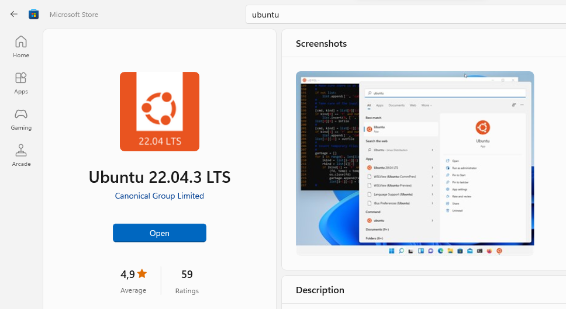

2. Enter your username and password

3. Now run this command to install the necessary packages

```
sudo apt install -y build-essential linux-headers-$(uname -r)
```

4. Change the ubuntu source list in to the code bellow

```
sudo nano /etc/apt/source.list"
```

```
deb http://archive.ubuntu.com/ubuntu/ jammy main restricted universe multiverse
deb-src http://archive.ubuntu.com/ubuntu/ jammy main restricted universe multiverse

deb http://archive.ubuntu.com/ubuntu/ jammy-updates main restricted universe multiverse
deb-src http://archive.ubuntu.com/ubuntu/ jammy-updates main restricted universe multiverse

deb http://archive.ubuntu.com/ubuntu/ jammy-security main restricted universe multiverse
deb-src http://archive.ubuntu.com/ubuntu/ jammy-security main restricted universe multiverse

deb http://archive.ubuntu.com/ubuntu/ jammy-backports main restricted universe multiverse
deb-src http://archive.ubuntu.com/ubuntu/ jammy-backports main restricted universe multiverse

deb http://archive.canonical.com/ubuntu/ jammy partner
deb-src http://archive.canonical.com/ubuntu/ jammy partner
```

5. Download and install all the latest packages

```
sudo apt update
```

```
sudo apt upgrade -y
```

6. Install lxc

```
sudo apt-get install lxc lxctl lxc-templates net-tools
```

7. Check the config and make sure everything in enabled

```
sudo lxc-checkconfig
```

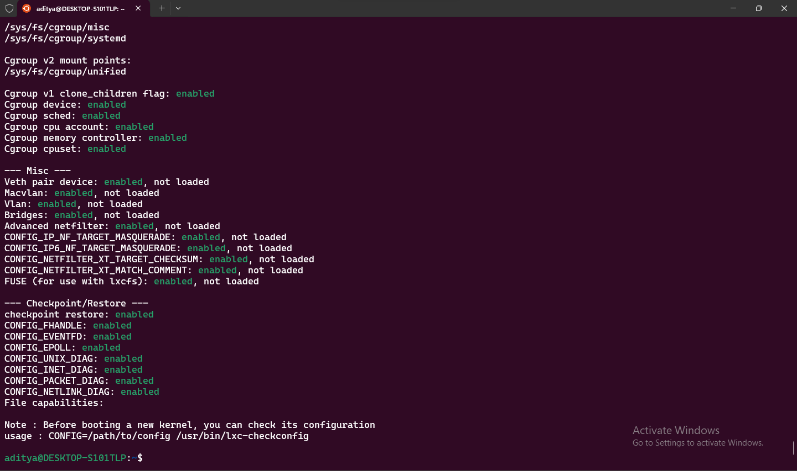

8. Install nginx

```
sudo apt install nginx nginx-extras
```

9. Go to /etc/nginx/sites-enabled/ and copy paste default file as sister.local

```
cd /etc/nginx/sites-enabled
```

```
sudo cp default sister.local
```

10. Edit sister.local

```
sudo nano sister.local
```

```
server {
        listen 80;
        listen [::]:80;

        server_name sister.local;

        root/var/www/html;
        index index.html;

        location / {
            try_files $uri $uri/ =404
        }
}
```

11. Go to /var/www/html/ and copy paste index.nginx-debian.html as index.html

```
cd /var/www/html/
```

```
sudo cp index.nginx-debian.html index html
```

12. Edit index.html

```
sudo nano index.html
```

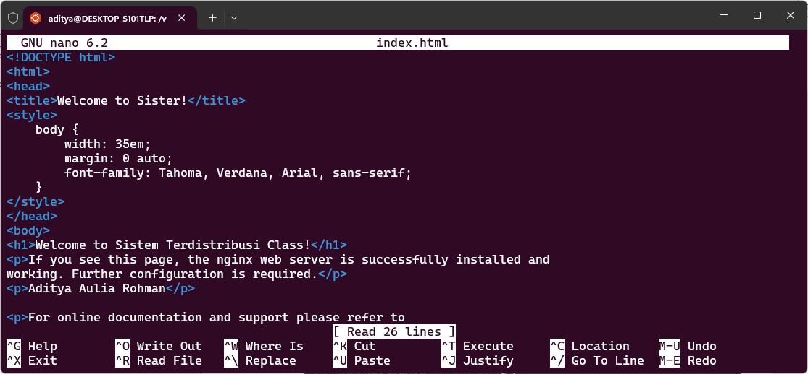

13. Open notepad as administrator and open file called hosts located in "C:\Windows\System32\drivers\etc"

14. Add "127.0.0.1 sister.local" at the end of the text and save
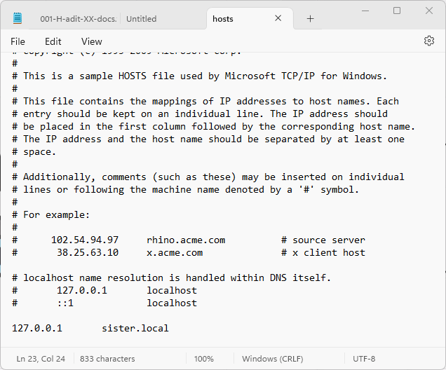

15. Try to open sister.local in a browser
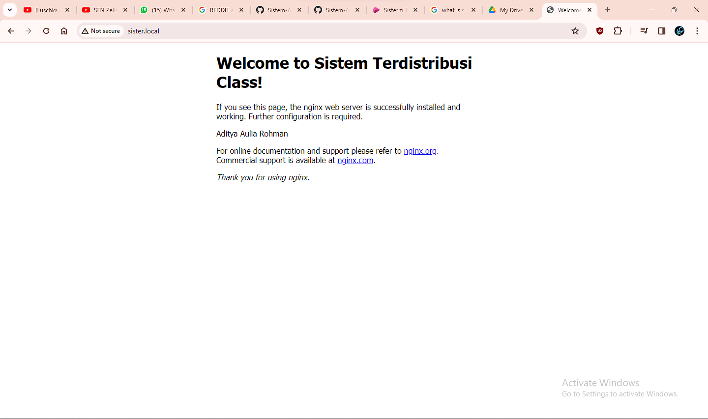

# Microservice1 and Microservice2

1. Make a linux container for blog named microservice1 using ubuntu 20 and another linux container for about us named microservice2 using ubuntu 18

```
sudo lxc-create -n microservice1 -t download -- --dist ubuntu --release focal --arch amd64 --force-cache --server images.linuxcontainers.org
```

```
sudo lxc-create -n microservice2 -t download -- --dist ubuntu --release bionic --arch amd64 --force-cache --server images.linuxcontainers.org
```

2. Start and attach both microservice1 and microservice2 and set a password

```
sudo lxc-attach -n microservice1
```

```
sudo lxc-attach -n microservice1
```

3. Edit file 10-lxc.yaml

```
sudo nano /etc/netplan/10-lxc.yaml
```

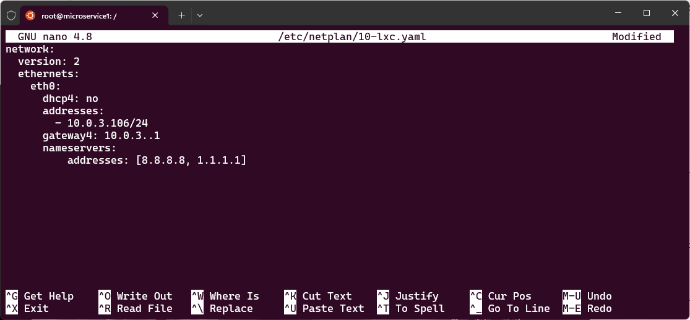

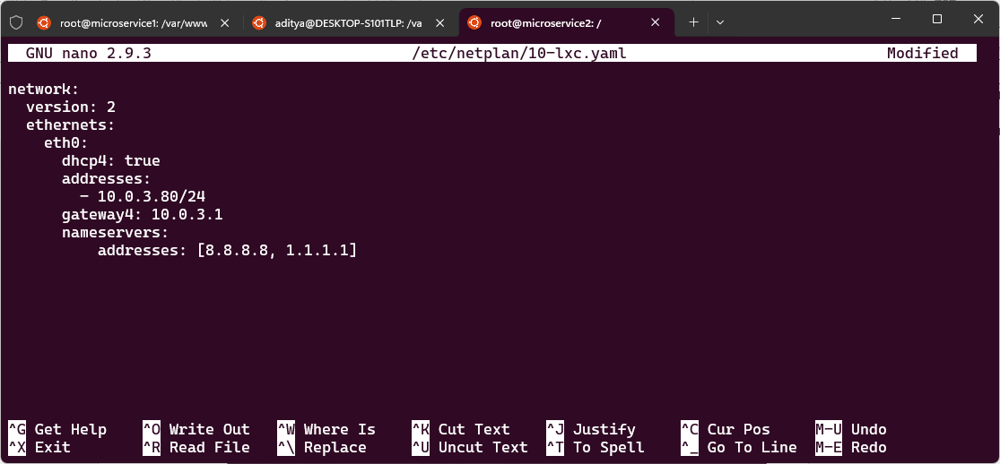

4. Apply the new netplan

```
sudo netplan apply
```

5. Run an update

```
apt update; apt upgrade -y
```

6. Install nginx and start the nginx server

```
sudo apt install nginx nginx-extras
```

```
sudo systemctl start nginx
```

7. Go to /var/www/html/ and copy index.nginx-debian.html as index.html then edit the index.html file

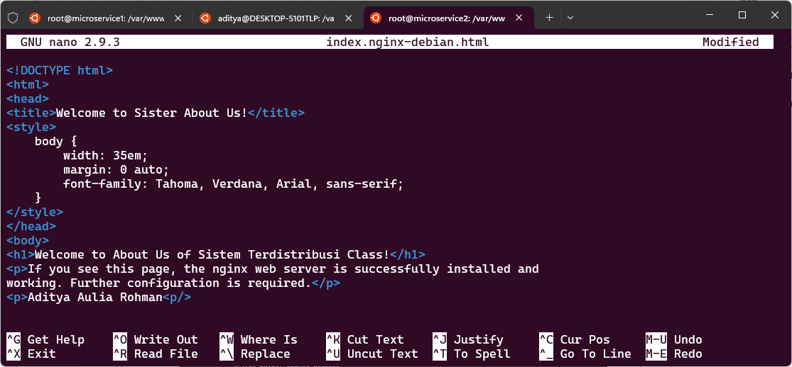

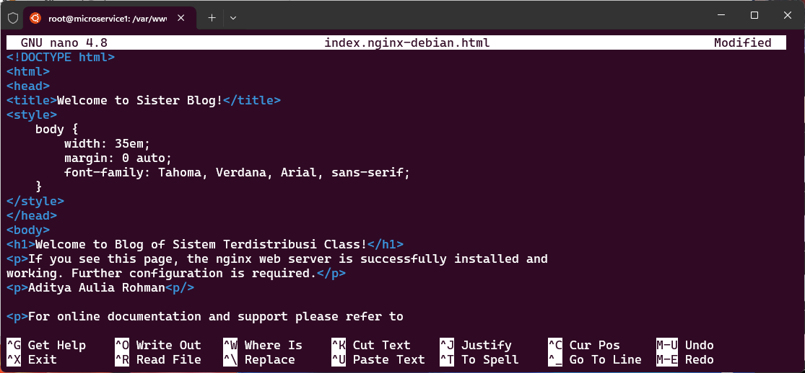

8. Go to /etc/nginx/sites-enabled/ and copy the default file as mcsv1.local/mcsv2.local then edit those files

```
cd /etc/nginx/sites-enabled/
```

```
cp default mcsv1.local

cp default mcsv2.local
```

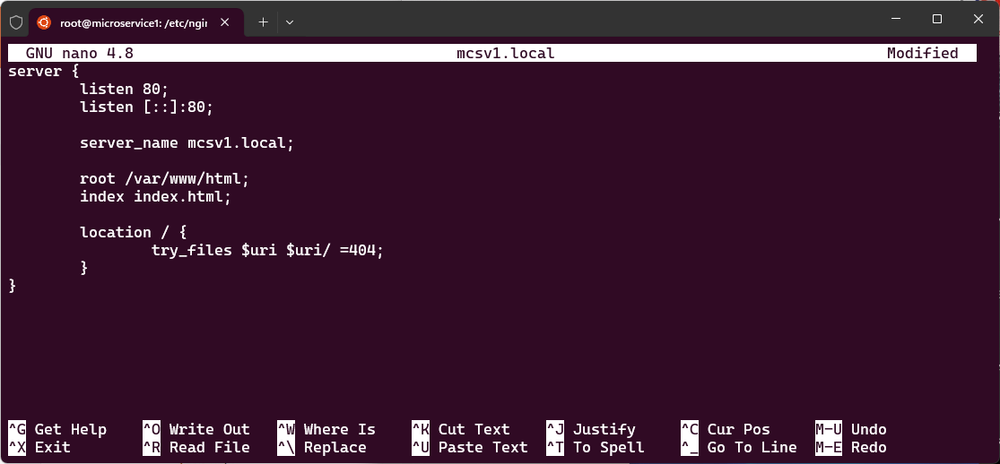

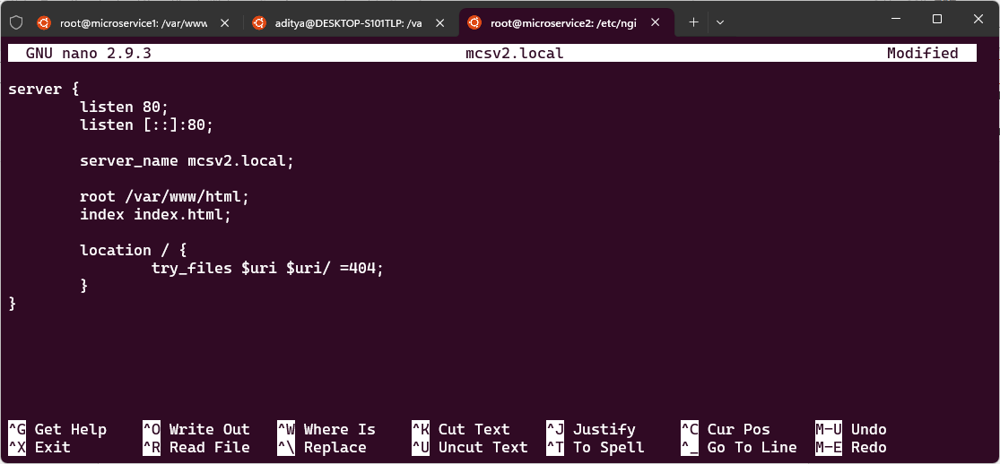

9. Add mcsv1.local/mcsv2.local to hosts

```
sudo nano /etc/hosts
```

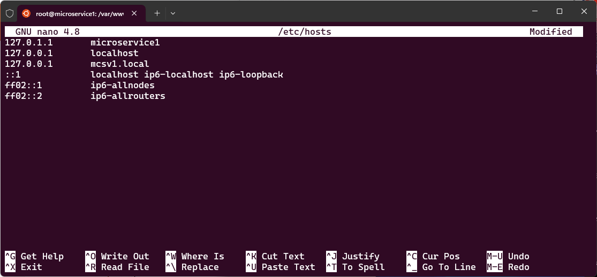

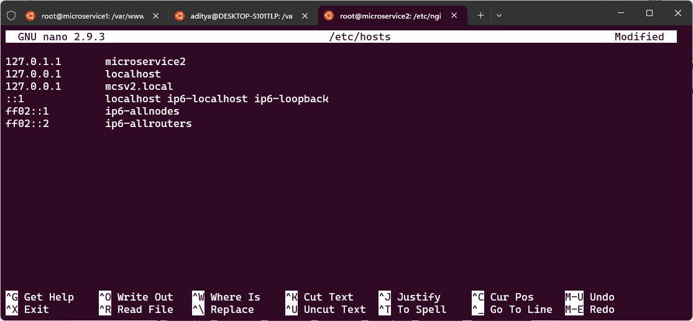

10. Now go to parent and add mcsv1.local/mcsv2.local to hosts

```
sudo nano /etc/hosts
```

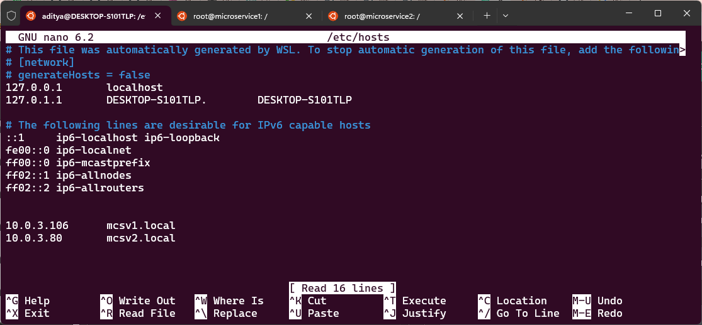

11. Go to /etc/nginx/sites-enabled/ and edit sister.local, add a condition so it can go to blog and about us

```
sudo nano /etc/nginx/sites-enabled/sister.local
```
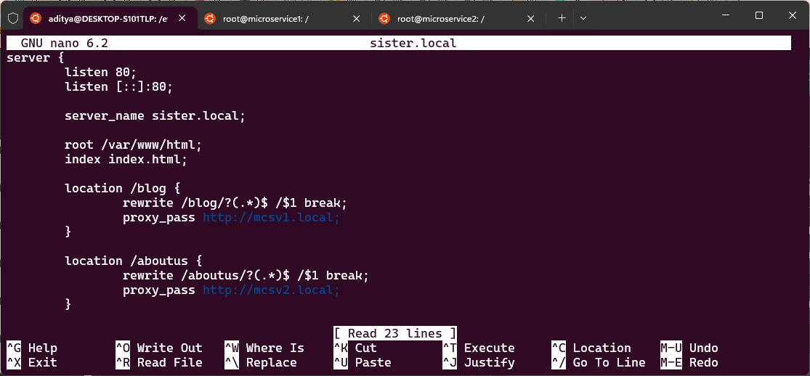

12. Try to open sister.local/blog and sister.local/about on a browser

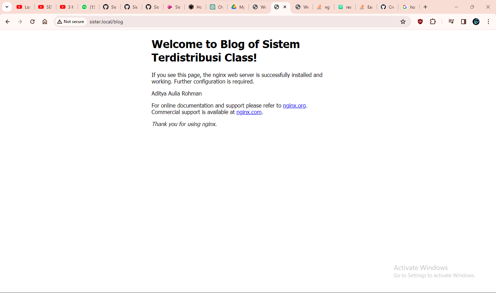

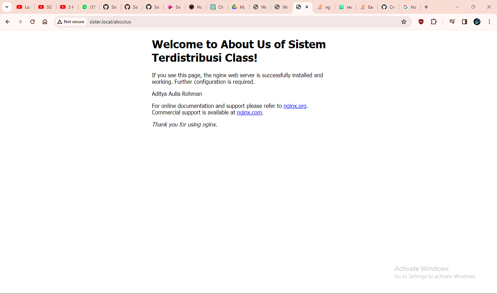

