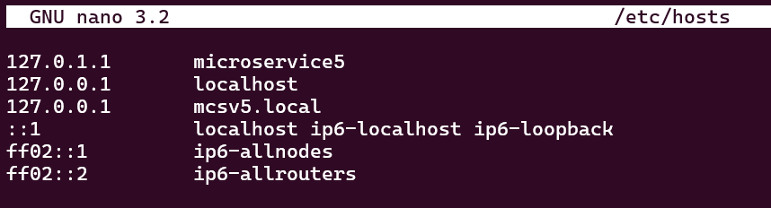

# Load Balancing using Round Robin Algorithm

Nama    : Aditya Aulia Rohman  
NIM     : 1203210145

1. Make a linux container named microservice3, microservice4, and microservice5 using Debian 10

```
sudo lxc-create -n microservice3 -t download -- --dist debian --release buster --arch amd64 --force-cache --server images.linuxcontainers.org
```
```
sudo lxc-create -n microservice4 -t download -- --dist debian --release buster --arch amd64 --force-cache --server images.linuxcontainers.org
```
```
sudo lxc-create -n microservice5 -t download -- --dist debian --release buster --arch amd64 --force-cache --server images.linuxcontainers.org
```

2. Starts all microservices

```
sudo lxc-start -n microservice3
sudo lxc-start -n microservice4
sudo lxc-start -n microservice5
```

3. Attach each microservices

```
sudo lxc-attach -n microservice3
```
```
sudo lxc-attach -n microservice4
```
```
sudo lxc-attach -n microservice5
```

4. Run an update and install nginx, nano, and curl on each microservices

```
apt update; apt upgrade -y
```
```
sudo apt install nginx nginx-extras
```
```
sudo apt install nano
```
```
sudo apt install curl
```

5. Start nginx on each server on each microservices

```
sudo systemctl start nginx
```
```
sudo systemctl status nginx
```

6. Edit the html file on each microservices

```
sudo nano /var/www/html/index.nginx-debian.html
```


7. Configure hosts on each microservices

```
sudo nano /etc/hosts
```




8. Now go to parent/wsl and configure the hosts

```
sudo nano /etc/hosts
```


9. Edit sister.local and add the round robbin algorithm

```
sudo nano /etc/nginx/sites-enabled/sister.local
```


10. Check the configuration

```
sudo nginx -t
```

11. Reload If the configuration is ok

```
sudo nginx -s reload
```

12. Try to curl app.sister.local (server will change on each refresh/curl)

```
sudo curl app.sister.local
```


13. Try to run app.sister.local on your browser (server will change on each refresh)


